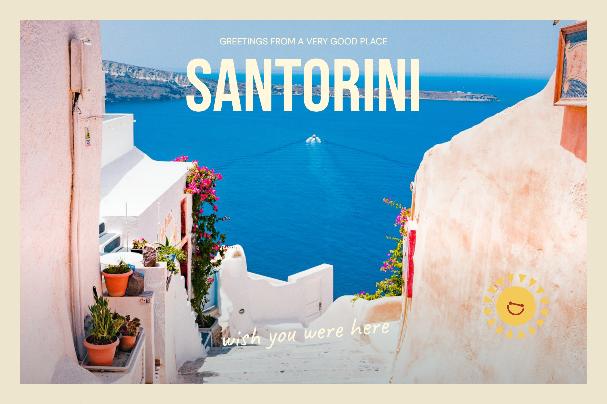

# PixelPost

**A little piece of somewhere.**

**Live demo:** [Try PixelPost](https://pixel-post-three.vercel.app)

**Repository:** [ItsMazino/PixelPost](https://github.com/ItsMazino/PixelPost)

A frontend-only postcard atelier built with **Next.js, TypeScript, shadcn/ui, and Framer Motion**. Turn a travel photo into a personal keepsake with editable typography, movable stickers, paper colors, a handwritten reverse side, and high-resolution PNG downloads and two-sided printable PDFs.

PixelPost is a working portfolio project: the editor, local gallery, photo processing, undo/redo, and exports run in the browser. There are no accounts, API keys, server routes, or databases.



[View the exported reverse side](docs/example-back.png)

## Table of contents

1. [Product overview](#product-overview)
2. [Core features](#core-features)
3. [Design direction](#design-direction)
4. [Technology stack](#technology-stack)
5. [Architecture](#architecture)
6. [Rendering and export](#rendering-and-export)
7. [State and persistence](#state-and-persistence)
8. [Photo processing](#photo-processing)
9. [Project structure](#project-structure)
10. [Local development](#local-development)
11. [Scripts and verification](#scripts-and-verification)
12. [Deployment](#deployment)
13. [Accessibility and responsive design](#accessibility-and-responsive-design)
14. [Privacy and performance](#privacy-and-performance)
15. [Limitations and troubleshooting](#limitations-and-troubleshooting)
16. [Asset credits](#asset-credits)

## Product overview

The studio opens with a complete postcard so visitors can try the product immediately. Its interface takes the form of a small stationery desk: a tool rail, a materials panel, a paper canvas, and contextual editing controls.

A typical workflow:

1. Start with Endless summer, Little adventures, A quiet moment, or From far away.
2. Choose a bundled travel photograph or upload your own image.
3. Add words and stickers. Drag them on the postcard, change their size and angle, and customize their colors.
4. Flip the postcard to write a message, address it, and add a signature.
5. Save it in your browser’s gallery, download either side as a PNG, or export both sides as a printable PDF.

The project is intentionally focused on a delightful creative tool. It does not simulate checkout, collaboration, cloud accounts, or physical postage.

## Core features

| Feature | Behavior |
| --- | --- |
| Four starting styles | Travel poster, scrapbook, minimal photograph, and striped airmail border. Starting a template prompts before replacing the draft. |
| Photo library | Three locally bundled travel photographs: Santorini, Kyoto, and Paris. |
| Personal photos | JPG, PNG, and WebP uploads up to 15 MB; converted to a resized JPEG locally. |
| Photo treatment | Original, warm, vintage, and monochrome filters, plus zoom and horizontal/vertical crop positioning. |
| Typography | Editable words with DM Sans, DM Serif Display, Caveat, and Bebas Neue. |
| Illustrated stickers | Sun, heart, flower, and star, rendered as vector paths on the canvas. |
| Direct manipulation | Pointer dragging with capture, drag controls for resize/rotation, sliders, and keyboard positioning. |
| Layers | Select from the layer list, duplicate, bring to the top, or remove. Up to 30 layers per postcard. |
| History | Up to 40 document snapshots for undo/redo. Drag gestures are stored as a single change. |
| Paper and postage | Palette and custom colors for paper, lettering, and back-side ink, plus four stamp motifs. |
| Reverse side | Editable message, recipient, and signature with a postal layout and animated flip. |
| Local gallery | Up to 12 named postcards. Saving an existing postcard updates that entry. |
| PNG export | Exports the currently visible side at 2400 × 1600 pixels. |
| Printable PDF | Both sides in one PDF, front first, with exact 6 × 4 inch pages and a printing guide. |
| Responsive workspace | Desktop materials panel, tablet overlay, and mobile bottom drawer. |

## Design direction

Visual research focused on [Papier](https://www.papier.com/) and [Vacation](https://vacation.inc/): editorial stationery typography, warm paper, nostalgic travel imagery, and playful details. PixelPost has its own composition and artwork.

- Cream paper and oxblood red establish a stationery identity.
- Fraunces gives the entire interface a warm, bookish character, with italic accents inspired by the word “somewhere” in the main heading. Primary controls use 14–16px type, with larger supporting text and stronger contrast.
- Caveat and Bebas Neue provide expressive postcard lettering; DM Sans and DM Serif Display remain available inside the artwork.
- A subtle dotted desk, deterministic paper grain, drawn postal marks, and small rotations create a physical feel.
- Framer Motion animates front/back transitions, gallery layout, and transient feedback. Reduced-motion preferences are respected.

## Technology stack

| Layer | Implementation |
| --- | --- |
| Framework | Next.js 16 App Router, statically exported |
| Language | TypeScript with strict checking |
| UI | React 19 |
| Controls | shadcn/ui source components using Radix UI primitives |
| Styling | Tailwind CSS 4, CSS custom properties, Grid, Flexbox, media queries |
| Animation | Framer Motion 14 |
| Rendering | Browser Canvas 2D API |
| Icons | Lucide React |
| Fonts | Self-hosted Fontsource packages |
| Persistence | localStorage |
| Tests | Node’s built-in test runner |

Exact dependency versions are recorded in `package-lock.json`.

## Architecture

The App Router page is a small server-rendered entry point. It mounts one client-side studio containing the interactive state. No request-time server logic is required.

`src/lib/postcard.ts` defines the typed document and layer models, template factories, persistence validation, image normalization, sticker drawing, and shared renderer. `src/components/studio.tsx` coordinates the editor, gallery, history, imports, and downloads. Generated shadcn components remain editable source under `src/components/ui/`.

```text
User action → typed postcard document → shared Canvas renderer
                       │                         │
                       ├─ undo / redo            ├─ studio preview
                       ├─ localStorage draft     ├─ gallery previews
                       └─ saved collection       └─ PNG / printable PDF
```

Each front-side layer has a stable ID, kind, content, position, size, rotation, color, and font. Layer array order determines paint order. The reverse side uses a fixed composition with user-editable content.

## Rendering and export

Postcards use a **1200 × 800 logical coordinate system**. The visible canvas scales responsively; pointer movement is translated back into logical coordinates. This keeps document positions independent of screen size.

The renderer explicitly loads all four fonts before painting. It then draws the paper, optional airmail border, clipped photo, photo treatment, text, stickers, and grain. The back uses the same paper and ink settings with a writing area, address lines, and illustrated postage.

Preview and export share `drawCard()`. PNG export doubles the render resolution to **2400 × 1600**, creates a Blob, and downloads it through a temporary object URL. Preview rendering uses an offscreen buffer and cancels outdated commits to avoid asynchronous image loads overwriting newer edits.

The interface describes a 6 × 4 inch aspect ratio. PNGs contain pixels, not a print-service specification: choose 6 × 4 inches in your print settings. No bleed or crop marks are generated. The **Download postcard PDF** button renders both sides at 2400 × 1600 pixels (400 pixels per inch at print size) and embeds them in two 432 × 288 point pages using a lazily loaded `pdf-lib` module. Both pages use a snapshot of the same draft, regardless of the selected side. PDF viewer preferences request actual-size printing and short-edge duplex; printer support varies. The on-screen printing guide recommends a plain-paper test before cardstock. PDF generation remains entirely in the browser.

## State and persistence

The workspace is stored under `pixelpost.workspace.v1`:

```ts
{
  version: 1,
  draft: Postcard,
  saved: Postcard[]
}
```

- Draft and gallery writes are debounced by 450 ms.
- Stored documents are checked before loading, including image sources and finite layer geometry.
- Undo/redo snapshots are kept in memory and reset on reload.
- A saved postcard has a UUID and a last-updated timestamp.
- The gallery is limited to 12 cards and each document to 30 layers to keep the tool manageable.
- Storage failures display a visible warning; export remains available.

Storage is per browser and origin. Localhost, a Vercel preview, and a production domain have separate galleries. Clearing site data removes locally saved work. The tool does not synchronize across tabs or devices.

## Photo processing

Uploads are validated before decoding. A valid image is resized to at most **1400 pixels on its longest side**, then encoded as JPEG at quality **0.82**. Temporary object URLs are revoked after processing. The normalized image is kept inside the postcard document as a data URL.

Photo crop uses a cover calculation, a zoom factor from 1 to 3, and two positional percentages. Filters are applied during drawing, so exported images include the selected treatment. The local image library and self-hosted fonts avoid runtime third-party asset requests.

## Project structure

```text
PixelPost/
├── public/photos/              # Bundled sample photographs
├── src/app/
│   ├── layout.tsx              # Metadata and local fonts
│   ├── page.tsx                # Studio entry point
│   ├── icon.svg                # Custom envelope icon
│   ├── globals.css             # Tailwind and shadcn base
│   └── studio.css              # Product design and responsive layout
├── src/components/
│   ├── studio.tsx              # Editor, gallery, controls, history
│   └── ui/                     # shadcn/Radix source components
├── src/lib/
│   ├── postcard.ts             # Model, templates, rendering, image processing
│   ├── printable.ts            # Two-sided PDF generation and print dimensions
│   └── utils.ts                # UI utilities
├── tests/
│   ├── postcard.test.mjs        # Model and upload validation tests
│   └── MANUAL.md               # Browser acceptance checklist
├── ASSETS.md                   # Asset and inspiration credits
├── components.json             # shadcn configuration
└── next.config.ts              # Static export configuration
```

## Local development

Use **Node.js 22.18 or newer** and npm. The tests use Node’s TypeScript stripping support.

```bash
cd PixelPost
npm ci
npm run dev
```

Open `http://localhost:3000`. For another development port:

```bash
npm run dev -- --port 5182
```

No environment variables or external services are required.

## Scripts and verification

| Command | Purpose |
| --- | --- |
| `npm run dev` | Next.js development server |
| `npm run build` | Production build and static export into `out/` |
| `npm start` | Serve the static output at `http://localhost:5180` |
| `npm run lint` | ESLint, including React and Next.js rules |
| `npm run typecheck` | TypeScript checks |
| `npm test` | Nine tests covering templates, persisted document validation, rejected uploads, PDF page geometry, and invalid PDF images |

Run `npm run build` before `npm start`. Because this project uses static export, `next start` is not its production preview command.

Browser acceptance steps are documented in [tests/MANUAL.md](tests/MANUAL.md). They cover creating, editing, dragging, undo/redo, photos, back-side notes, saving, reload persistence, PNG output, and responsive layouts. Automated tests focus on the document boundary and upload validation; they are not a substitute for browser interaction checks.

## Deployment

PixelPost produces a static site. It can be deployed to Vercel or another static host without a database, server function, or environment secret.

For Vercel:

1. Push this directory as a repository, or select `PixelPost` as the root directory in a larger repository.
2. Import it into Vercel and use the Next.js preset.
3. Install with `npm ci` and build with `npm run build`.
4. The static output is `out/`; the Next.js integration recognizes `output: 'export'`.

For a generic static host, publish the contents of `out/`. Asset paths currently assume the site is hosted at the domain root. A subdirectory deployment requires a Next.js `basePath` and matching asset path changes.

The live deployment is [pixel-post-three.vercel.app](https://pixel-post-three.vercel.app). Vercel is connected to this repository and deploys updates pushed to `main`.

## Accessibility and responsive design

- Semantic buttons, headings, labels, and navigation.
- Named sliders and icon-only controls.
- Radix dialog focus management and Escape dismissal.
- Keyboard-operable layer selection and arrow-key movement.
- Contextual form controls provide an alternative to drag gestures.
- Canvas previews have descriptive accessible names; editable layer controls remain real DOM elements.
- Framer Motion’s `reducedMotion="user"` and a CSS reduced-motion media query.
- Mobile materials open in a compact bottom panel; tablet layouts use an overlay panel.

The canvas image is not a rich semantic document. The named layer list and text fields expose its editable content, but this is not a claim of a formal WCAG audit.

## Privacy and performance

All editing and photo processing happen on the device. No analytics, upload endpoint, authentication, or remote image service is called by the application. A hosting provider will still receive ordinary requests for static site assets.

Fonts are bundled locally; images are cached after decoding. Template preview documents are stable, so moving a sticker does not rerender every template. History is bounded and exports use temporary Blob URLs that are revoked after download.

## Limitations and troubleshooting

| Situation | Explanation / resolution |
| --- | --- |
| Gallery disappears on another device | Saves belong to this browser and origin. Download postcards you want to keep. |
| Storage warning | Uploaded photos can fill localStorage. Export work and remove older gallery cards, or use smaller photos. The 12-card cap does not guarantee every browser can store 12 large uploads. |
| Unsupported upload | Convert HEIC, SVG, or animated formats to JPG, PNG, or WebP first. |
| Long notes | Messages allow 220 characters and up to eight entered lines; the renderer shows up to eight wrapped lines. Recipient text uses up to four lines. Check the back before export. |
| Missing photo | Choose another bundled image or upload the file again. |
| Blank or fallback lettering | Fonts must finish loading before rendering. The renderer explicitly waits for them; check that static font assets are available. |
| Exported side is unexpected | PNG export follows the selected front/back tab. PDF export always includes both sides, front first. |
| Undo disappears after refresh | History is session-only; the latest draft and gallery persist. |

There is no multiplayer editing, cloud backup, physical mail service, SVG export, arbitrary photo layering, or print fulfillment. Uploaded photos replace the template’s primary photo. The project is designed as a focused, complete frontend showcase.

## Asset credits

See [ASSETS.md](ASSETS.md) for photo sources, font licenses, UI libraries, and design references.


